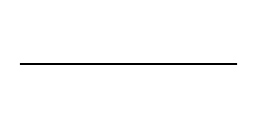
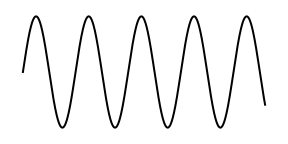
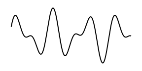
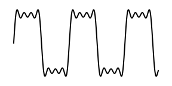
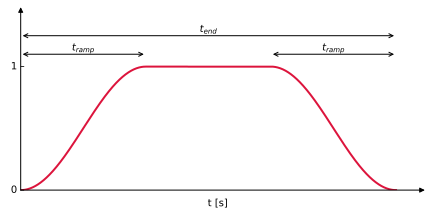

This document provides supplementary documentation for **Bubble dynamics simulation C++**.

# Supplementary documentation for **Bubble dynamics simulation C++**

## Table of contents

- [Inputs](#inputs)
    - [Chemical mechanisms](#chemical-mechanisms)
    - [Excitations](#excitations)
    - [Prescribed excitation or radius profile](#prescribed-excitation-or-radius-profile)
- [Outputs](#outputs)

## Inputs

The inputs/settings of an individual simulation are stored in a dictionary/struct/map, called control parameters. Content of control parameters (`cpar`):

| Category | Name | Symbol | Description | Unit |
|:---|:---|:---:|:---|:---:|
| | `ID` | | A unique number identifying the simulation, only relevant for parameter studies (int) | |
| | `mechanism` | | Name of chemical mechanism (string) to use, see [Chemical mechanisms](#chemical-mechanisms) | |
| **Initial conditions** | `R_E` | $R_E$ | Equilibrium bubble radius | $m$ |
| | `ratio` | $R_0/R_E$ | Ratio of initial and equilibrium bubble size (for unforced vibrations) | $1$ |
| | `species` | $\{\chi_1, \chi_2, \ldots\}$ | List of chemical symbols (string) of initial species | |
| | `fractions` | $\{X_1, X_2, \ldots\}$ | List of molar fractions of initial species | $1$ |
| | `P_amb` | $P_\infty$ | Ambient pressure | $Pa$ |
| | `T_inf` | $T_\infty$ | Ambient temperature | $K$ |
| **Ambient liquid** | `alpha_M` | $\alpha_M$ | Accommodation coefficient of evaporation | $1$ |
| | `P_v` | $P_v$ | Saturated vapour pressure | $Pa$ |
| | `mu_L` | $\mu_L$ | Dynamic viscosity | $Pa \cdot s$ |
| | `rho_L` | $\rho_L$ | Liquid density | $kg/m^3$ |
| | `c_L` | $c_L$ | Sound speed | $m/s$ |
| | `surfactant` | $\sigma_L/\sigma_{H_2O}$ | Ratio of liquid surface tension and water's surface tension | $1$ |
| **Simulation settings** | `enable_heat_transfer` | | Toggles heat transfer between the bubble and ambient liquid | |
| | `enable_evaporation` | | Toggles evaporation (ambient liquid is assumed to be water) | |
| | `enable_reactions` | | Toggles chemical reactions | |
| | `enable_dissipated_energy` | | Toggles dissipated energy, should be false for unforced vibrations | |
| | `enable_van_der_waals` | | Toggles between ideal and van der Waals state equation | |
| | `enable_gilmore` | | Toggles between Keller-Miksis and Gilmore bubble model | |
| | `enable_nasg` | | Toggles between Tait and NASG liquid equation of state (requires `enable_gilmore`) | |
| | `enable_rate_thresholding` | | Toggles reaction rate thresholding, improves stability | |
| **Excitation** | `excitation_type` | | Type of excitation (string), see [Excitations](#excitations) | |
| | `excitation_params` | | List of excitation parameters | |
| | `excitation_cycles` | | The number of cycles the excitation lasts | $1$ |
| | `ramp_up_cycles` | | The number of ramp-up cycles until the peak amplitude is reached | $1$ |

 > To use user defined pressure excitation or radius profiles, see chapter [Prescribed excitation or radius profile](#prescribed-excitation-or-radius-profile).

### Chemical mechanisms

Chemical mechanisms are stored in [./mechanism](./mechanism). They are converted from Chemkin INP files to Cantera YAML files, and then to JSON files with the provided Python scripts. See [./mechanism/README.md](./mechanism/README.md) for details and to add new mechanisms.

When parsed, these structs are turned into const static members of the `Parameters` class in [./include/parameters.h](./include/parameters.h). This class stores all arrays in a flattened form as raw pointers. Usage: `const Parameters *par = Parameters::get_parameters("chemkin_elte2016_hydrogen");` and get any members like `par->nu`.

Available mechanisms:
| Name                         | Reagent atoms | Non-reagent molecules | Number of species [-] | Number of reactions [-] |
|------------------------------|----------------|------------------------|------------------------|--------------------------|
| noreaction_air               | -              | N2, O2, H2O, Ar        | 4                      | 0                        |
| uson2022_hydrogen            | H, O           | -                      | 10                     | 34                       |
| elte2016_hydrogen            | H, O           | He, N2, Ar             | 12                     | 30                       |
| elte2016_syngas              | H, C, O        | He, N2, Ar             | 15                     | 44                       |
| elte2016_ethanol             | H, C, O        | He, N2, Ne, Ar, Kr     | 49                     | 251                      |
| elte2017_methanol            | H, C, O        | He, N2, Ne, Ar, Kr     | 24                     | 102                      |
| kaust2023_ammonia            | H, N, O        | He, Ar                 | 32                     | 243                      |
| kaust2023_ammonia_oxygenless | H, N           | He, Ar                 | 14                     | 49                       |
| otomo2018_ammonia            | H, N, O        | He, Ar                 | 32                     | 213                      |
| otomo2018_ammonia_oxygenless | H, N           | He, Ar                 | 12                     | 35                       |

It is recommended to choose the smallest mechanism capable of accurately capturing the
phenomenon of interest. Use `noreaction_air` to model bubble dynamics without any chemical kinetics.

The mechanisms `chemkin_uson2022_hydrogen` and `chemkin_elte2016_hydrogen` are suited to simulate the hydrolysis of water. Meaning that a bubble filled with an inert gas, like argon ($Ar$), can dissociate the water ($H_2O$) present 
through evaporation into hydrogen ($H_2$) and oxygen ($O_2$). Alternative objectives include the production of hydrogen peroxide ($H_2O_2$) from an oxygen-rich bubble also with the contribution of water vapour. Another goal might be to produce some reagent radicals ($OH$, $H_2O_2$) for sterilization.

The mechanisms `chemkin_elte2016_syngas`, `chemkin_elte2017_methanol`, and `chemkin_elte2016_ethanol` can be used to simulate various forms of carbon capture. In the simplest case, carbon-dioxide ($CO_2$) and water vapour ($H_2O$) is turned into syngas ($H_2$ and $CO$). In more complex cases, the goal is to synthesize methanol ($CH_3OH$) or ethanol ($CH_3CH_2OH$) as potential fuels.

The mechanisms `chemkin_kaust2023_ammonia` and `chemkin_otomo2018_ammonia` are used to simulate ammonia ($NH_3$) production from hydrogen ($H_2$) and nitrogen ($N_2$). This process might be coupled with hydrogen production. More lightweight oxygen-free variants are also available if evaporation is not considered. However, even trace amounts of oxygen can lead to significantly different results. Note that `chemkin_otomo2018_ammonia` is considered deprecated, but it is kept for comparison with older versions. In the future, even larger mechanisms will be tested incorporating $H$, $C$, $N$, $O$ molecules simultaneously to investigate the possibility of direct fertilizer production, like urea ($CO(NH_2)_2$).


### Excitations

Python notebook [./try_excitations.ipynb](./try_excitations.ipynb) showcases the available pressure excitations. Available excitation types:
| Name            | Arguments                    | Units                | Formula                                                                                                                                   | Image |
|-----------------|------------------------------|----------------------|-------------------------------------------------------------------------------------------------------------------------------------------|--------|
| **no_excitation** | –                            | –                    | $0$                                                                                                                                       |        |
| **sinusoid**      | $p_A, f$                     | Pa, Hz               | $p_A \cdot \sin(2\pi f t)$                                                                                                                |  |
| **two_sinusoids** | $p_{A1}, p_{A2}, f_1, f_2, \theta$ | Pa, Pa, Hz, Hz, rad  | $p_{A1} \cdot \sin(2\pi f_1 t) + p_{A2} \cdot \sin(2\pi f_2 t + \theta)$                                                                 |  |
| **square**        | $p_A, f, n$                  | Pa, Hz, –            | $\displaystyle \sum_{\substack{i=1 \\ i\ \text{odd}}}^{2n+1} \frac{4p_A}{\pi i} \sin(2\pi f i t)$                                        |  |


These types all represent a continuous periodic excitation. To make the excitations time bounded, an additional control parameter (*excitation_cycles*) is introduced, which defines the total duration of the excitation. The excitation is active from $0$ to $t_{\mathrm{end}} = \mathrm{excitation\_cycles} / f$ seconds.

To make the excitation realistic, a ramp-up phase is added at the beginning, where the amplitude increases linearly from 0 to the full amplitude. The same ramp-down phase is added at the end. This is controlled by the control parameter ramp_up_cycles, which defines $t_{\mathrm{ramp}} = \mathrm{ramp\_up\_cycles} / f$ seconds. To achieve the ramp-up and ramp-down, the pressure excitation is multiplied by an envelope function $w(t)$ called the Tukey window:

$$
w(t) =
\begin{cases}
\dfrac{1 - \cos\left( \dfrac{\pi t}{t_{\mathrm{ramp}}} \right)}{2}, & 0 \le t < t_{\mathrm{ramp}} \\[1.2em]
1, & t_{\mathrm{ramp}} \le t \le t_{\mathrm{end}} - t_{\mathrm{ramp}} \\[0.6em]
\dfrac{1 - \cos\left( \dfrac{\pi (t_{\mathrm{end}} - t)}{t_{\mathrm{ramp}}} \right)}{2}, & t_{\mathrm{end}} - t_{\mathrm{ramp}} < t \le t_{\mathrm{end}} \\[1.2em]
0, & \text{otherwise}
\end{cases}
$$



Excitations are controlled by 4 control parameters:
 * **excitation_type**: One of the above types as string, e.g.: `"sinusoid"`
 * **excitation_cycles**: Number of cycles the excitation lasts. For *no_excitation*, this parameter is irrelevant. Otherwise, the excitation lasts for *excitation_cycles / freq* seconds. In case of *two_sinusoids*, *freq1* is used.
 * **ramp_up_cycles**: Number of cycles for the ramp-up phase. For *no_excitation*, this parameter is irrelevant. The condition *0 <= ramp_up_cycles <= excitation_cycles / 2* should be satisfied.
 * **excitation parameters**: depending on excitation type, different parameters are needed. See below for details. In this notebook, they are passed as keyword arguments. However, in the C++ code, they are passed as an array of doubles, and the order matters.

### Prescribed excitation or radius profile

Instead of using the built-in periodic excitations or solving the full bubble dynamics (Keller-Miksis or Gilmore equation), you can provide your own measured or simulated data. This is useful when you want to enforce a specific pressure excitation field ($p(t)$) or force the bubble radius to follow a custom shape ($R(t)$).

To use this feature, specify the path to your CSV file using one of the following control parameters:
 * `excitation_profile_file` (string): Path to a CSV file (e.g., `"./data/excitation.csv"`). When specified, it overrides the `excitation_type`, `excitation_params`, `excitation_cycles`, `ramp_up_cycles` parameters.
 * `radius_profile_file` (string): Path to a CSV file (e.g., `"./data/radius_data.csv"`). Essentially removes the bubble dynamics equations (Keller-Miksis / Gilmore) and directly forces the $R(t)$, $\dot{R}(t)$, and $\ddot{R}(t)$ values from the interpolator. When specified, it overrides the `R_E`, `ratio`, `excitation_type`, `excitation_params`, `excitation_cycles`, `ramp_up_cycles` parameters.

Both files must follow a strict comma-separated layout. The series must have a header. The first column represents the time ($t$), and the second column represents the variable ($p$ or $R$). Extra columns are ignored. The data must be arranged monotonically in time.

**Expected format for `excitation_profile_file`:**
```csv
t [s], p [Pa]
0.0, 101325.0
1e-6, 120000.0
```

**Expected format for `radius_profile_file`:**
```csv
t [s], R [m]
0.0, 10.0e-6
1e-6, 11.5e-6
```

## Outputs

Content of return value of `run_simulation()`, often referred to as `data`:

| Main key | Subkey | Symbol | Description | Unit |
|:---|:---|:---:|:---|:---:|
| `postproc` | `R_max` | $R_{max}$ | Maximum bubble radius | $m$ |
| | `R_min` | $R_{min}$ | Minimum bubble radius (at collapse) | $m$ |
| | `T_max` | $T_{max}$ | Maximum temperature inside the bubble | $K$ |
| | `T_min` | $T_{min}$ | Minimum temperature inside the bubble | $K$ |
| | `t_peak` | $t_{peak}$ | Time of collapse (maximal temperature) | $s$ |
| | `v_max` | $v_{max}$ | Maximum bubble wall velocity | $m/s$ |
| | `Ma_max` | $Ma_{max}$ | Maximum Mach number of the bubble wall (using local $c_L$) | $1$ |
| | `T_L_max` | $T_{L,max}$ | Maximum liquid temperature at the bubble wall (only relevant for Gilmore) | $K$ |
| | `p_internal_max` | $p_{int,max}$ | Maximum internal pressure | $Pa$ |
| | `p_internal_min` | $p_{int,min}$ | Minimum internal pressure | $Pa$ |
| | `c_L_max` | $c_{L,max}$ | Maximum liquid sound speed (only relevant for Gilmore) | $m/s$ |
| | `rho_L_max` | $\rho_{L,max}$ | Maximum liquid density (only relevant for Gilmore) | $kg/m^3$ |
| | `n_target_specie` | $n_{target}$ | Final molar amount of `target_species` | $mol$ |
| | `energy_demand` | | Energy demand for `target_species` production. Not SI! | $MJ/kg$ |
| | `dissipated_energy` | $E_{diss}$ | Total dissipated energy (acoustic, thermal, viscous) | $J$ |
| | `expansion_work` | $W_P$ | Expansion work/initial potential energy (for unforced oscillations) | $J$ |
| `sol` | `success` | | Whether the simulation completed without error | |
| | `error` | | Error message string | |
| | `runtime` | | Wall-clock runtime of the solver | $s$ |
| | `num_dim` | | Number of ODE dimensions (3 + num_species + 1) | |
| | `num_steps` | | Number of accepted solver steps | |
| | `num_saved_steps` | | Number of saved time points | |
| | `num_repeats` | | Number of step repeats (due to error control) | |
| | `num_fun_evals` | | Number of RHS function evaluations | |
| | `num_fun_evals_jac` | | Number of RHS evaluations for Jacobian | |
| | `num_jac_evals` | | Number of Jacobian evaluations | |
| | `num_nonlin_iters` | | Number of nonlinear solver iterations | |
| | `total_error` | | Accumulated per-dimension integration error | |
| | `t` | $t$ | Time array | $s$ |
| | `x` | | Full state vector (index as `x[step_num][dim_num]`) | |
| | `R` | $R$ | Bubble radius time series | $m$ |
| | `R_dot` | $\dot{R}$ | Bubble wall velocity time series | $m/s$ |
| | `T` | $T$ | Internal temperature time series | $K$ |
| | `E_diss` | $E_{diss}$ | Dissipated energy time series | $J$ |
| | `p_excitation` | $p_{exc}$ | External excitation pressure time series | $Pa$ |
| | `p_internal` | $p_{int}$ | Internal pressure time series | $Pa$ |
| | `n_<species>` | $n_{\chi_i}$ | Molar amount time series for each species $\chi_i$, e.g.: `n_H2O` | $mol$ |
| `excitation` | `type` | | Excitation type string | |
| | `names` | | List of excitation parameter names | |
| | `units` | | List of excitation parameter units | |
| `mechanism` | `model` | | Name of the chemical mechanism | |
| | `num_species` | | Number of chemical species | |
| | `num_reactions` | | Number of chemical reactions | |
| | `species_names` | | List of species name strings | |
| `cpar` | | | Copy of the input control parameters | |
| `version` | | | Solver version string | |


